# 아트 작업기간

아트 작업 기간은 우선 7월 중순까지 배경 및 카드 일러스트 작업을 중심으로 진행하고자 합니다. 카드게임이라는 장르 특성상 실제 플레이 화면의 분위기와 카드 가독성이 중요하다고 판단하여, 우선적으로 전투 필드 배경과 주요 카드 일러스트들을 먼저 제작하고자 합니다.

이후 8월까지는 캐릭터 일러스트와 아이콘 작업을 추가로 요청드릴 예정입니다. 캐릭터는 게임 내에서 지속적으로 크게 노출되는 형태보다는 전투 중 상태 표시 및 캐릭터 선택 화면 중심으로 사용될 예정이며(자세한 내용은 작업량 파트에 설명하겠습니다), 아이콘 역시 상태이상, 덱, UI 표기 등 실제 플레이에 필요한 요소들을 포함합니다.

또한 8월 중에는 실제 게임에 아트를 적용해 본 결과를 바탕으로 수정 작업을 요청드릴 가능성이 있습니다. 이 수정은 전체 리소스를 새로 제작하는 방향보다는, 실제 플레이 과정에서 확인되는 가시성과 화면 구성 문제를 개선하기 위한 목적에 가깝습니다. 예를 들어 카드 색조 조정, 배경과 카드 간 대비 수정, UI 내 시인성 개선, 일부 일러스트의 구도 및 강조 요소 조정 등이 포함될 수 있습니다.

# 그림체

그림체는 기본적으로 가독성을 우선시하기 위해 선화를 사용하는 방향으로 생각하고 있습니다. 다만 깔끔한 셀 애니메이션풍보다는, 거친 질감이 느껴지는 브러쉬와 텍스처 중심의 채색을 사용하여 전체적인 분위기를 구성하고자 합니다. 선화 역시 지나치게 매끄럽거나 정제된 느낌보다는, 어느 정도 러프한 붓 터치가 살아있는 형태를 의도하고 있습니다.

카드 일러스트의 묘사량은 첨부한 카드게임 예시 정도를 기준으로 생각하고 있습니다. 카드 크기에서 즉시 읽히는 실루엣과 행동 전달을 중요하게 보고 있으며, 지나치게 복잡한 디테일보다는 형태 가독성을 우선하고자 합니다. 또한 카드 약 40장과 배경 작업이 비교적 짧은 기간 내에 제작되어야 하는 만큼, 지나치게 높은 원화급 디테일보다는 빠른 생산성과 통일된 분위기를 유지할 수 있는 수준의 퀄리티를 목표로 하고 있습니다.

전체 색감은 실제 플레이 중 카드 효과와 정보를 빠르게 구분할 수 있도록 어느 정도 통일된 방향으로 유지하고자 합니다. 대신 채색 과정에서는 단색 위주의 단순 셀채색보다는, 브러쉬 질감과 어우러지는 텍스처 기반 표현을 선호합니다. 첨부한 풍경 레퍼런스처럼 거친 브러쉬 분위기를 참고하고자 하며, 최종적으로는 카드게임 UI 안에서도 형태와 색이 쉽게 읽히는 방향을 목표로 하고 있습니다.

작업 과정에서 AI 보조 사용은 가능하며, 실제 작업 요청 시에는 간단한 컨셉 아트와 구도 레퍼런스를 함께 전달드릴 예정입니다. 또한 카드 레퍼런스 외에도 첨부한 풍경 이미지와 유사한 브러쉬 질감 및 분위기를 주요 참고 방향으로 생각하고 있습니다.

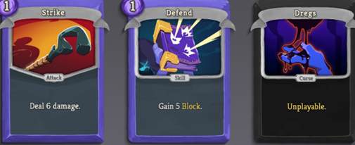

*1. 카드 레퍼런스*

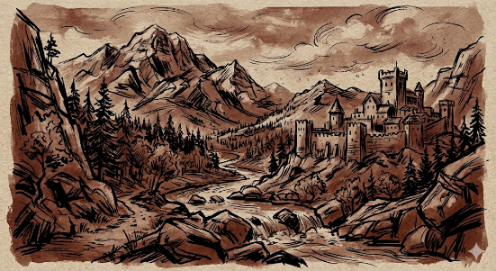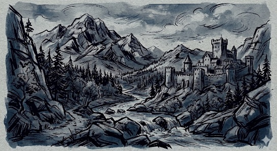

*2. 질감 및 분위기 레퍼런스. 색감을 통일한 느낌을 전달하고자 서로 다른 색조의 2장 첨부*

*카드 일러스트는 레퍼런스의 분위기와 브러쉬 질감을 참고하고자 하나, 실제 작업에서는 카드게임 UI 내 가독성과 짧은 제작 기간을 고려하여 디테일과 묘사량은 더 단순화된 방향을 예상하고 있습니다.*

# 예상되는 작업량

현재 예상으로는

- 캐릭터

- 카드 약 30-40장의 일러스트

- 배경, UI 및 아이콘

정도가 필요합니다. 모든 요소들은 러프를 제공해드릴 예정이며, 애니메이션은 내부에서 오브젝트의 움직임으로 처리할 계획이므로 그림에서 구현하지 않습니다. 이 중에서 가장 중요하게 생각하는 부분은 카드 일러스트와 카드의 가독성입니다.

## 캐릭터

캐릭터는 게임 내에서 서사를 전달하거나 지속적으로 화면의 중심이 되는 대상이라기보다는, 플레이어가 자신의 플레이 방향을 선택하고 적의 특성을 확인할 때 사용하는 구분 요소에 가깝게 생각하고 있습니다. 따라서 캐릭터 디자인에서 가장 중요하게 보고 있는 부분은 세부 설정이나 복잡한 장식보다는, 플레이 중 빠르게 인식 가능한 역할 식별입니다.

실제 플레이 화면에서는 캐릭터가 크게 노출되지 않을 예정이므로, 지나치게 세밀한 디테일보다는 실루엣과 색 분리를 통해 각 캐릭터를 즉시 구분할 수 있는 방향을 우선시하고자 합니다.

캐릭터 수는 현재 기준 약 6명 정도를 예상하고 있습니다. 각 캐릭터는 서로 다른 역할군처럼 인식될 수 있도록, 형태와 체형, 의상 구조, 주요 색감 등을 통해 차이를 주고자 합니다. 예를 들어 특정 캐릭터는 넓고 무거운 실루엣, 다른 캐릭터는 가늘고 긴 형태처럼 외형 자체에서 차이가 드러나는 방향을 생각하고 있습니다. 또한 전체적인 색조는 세계관 분위기에 맞춰 어느 정도 통일감을 유지하되, 실제 플레이 상황에서 캐릭터를 빠르게 구분할 수 있도록 주요 포인트 색은 명확히 분리하고자 합니다.

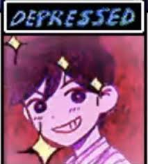캐릭터 일러스트의 사용 방식은 첨부한 *OMORI* 전투 UI의 캐릭터 상태창과 유사한 방향을 생각하고 있습니다. 즉, 화면 전체를 크게 차지하는 전신 중심의 일러스트보다는, 플레이 중 빠르게 상태와 역할을 인식할 수 있는 반신 중심의 구성에 가깝습니다. 기본적으로는 머리와 상반신 위주로 노출되며, 상황에 따라 어깨 아래~허리 정도까지 표현되는 구도를 예상하고 있습니다.

캐릭터별로 요청드리고자 하는 일러스트는 크게 다음과 같습니다.

기본 상태(idle) 일러스트

피격 상태 일러스트

승리 상태 일러스트

총 3장의 상태 일러스트를 기준으로 생각하고 있으며, 각 상태는 완전히 새로운 구도를 요구하기보다는 기본 포즈를 바탕으로 표정이나 자세 변화가 추가되는 형태를 예상하고 있습니다. 또한 실제 카드게임 플레이 화면에서 카드를 제시하는 연출에 사용할 손 이미지 역시 캐릭터별로 하나씩 요청드리고자 합니다.

## 카드 일러스트

카드 일러스트는 첨부 예정인 유희왕 카드 이미지를 주요 레퍼런스로 생각하고 있습니다. 전체 카드의 비율은 대략 가로 2 : 세로 3 정도를 예상하고 있으며, 실제 일러스트가 들어가는 영역은 정사각형(1:1)에 가까운 형태로 구성하고자 합니다. 따라서 카드 일러스트는 세로로 긴 포스터형 구성보다는, 비교적 압축된 화면 안에서 주요 행동과 형태가 즉시 읽히는 방향을 우선시하고 있습니다.

.

*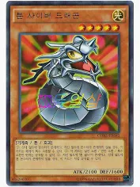*

*일러스트의 위치 및 비율 예시 이미지*

게임이 PC 기반 카드게임인 만큼 모바일 환경까지 고려할 필요는 없다고 생각하고 있습니다. 따라서 지나치게 작은 UI 최적화보다는, 컴퓨터 화면 기준에서 명확하게 읽히는 색 대비와 실루엣을 중요하게 보고 있습니다. 카드 하단에는 유희왕 카드처럼 작은 정보 영역이 존재할 예정이지만, 긴 텍스트 설명 대신 아이콘과 숫자 위주로 정보를 표시할 계획입니다. 이 때문에 실제 카드 일러스트는 카드 내부에서 가장 먼저 시선을 끄는 핵심 요소가 되기를 기대하고 있습니다.

카드 종류는 기본적으로 캐릭터나 몬스터를 소환하는 방식이 아니라, 플레이어의 행동 자체를 표현하는 액션 카드 형태를 생각하고 있습니다. 따라서 카드 일러스트 역시 특정 캐릭터의 초상화보다는, 공격 동작, 방어 연출, 상태 변화, 효과 발생 등의 상황과 행동 전달을 우선으로 구성되기를 원합니다.

또한 실제 플레이 중 카드 종류를 빠르게 구분할 수 있도록 카드 효과에 따라 주요 색 계열을 나누고자 합니다. 현재 기준으로는 다음과 같은 방향을 생각하고 있습니다.

- 공격 계열: 빨강

- 방어 계열: 파랑

- 변화/효과 부여 계열: 초록 또는 보라

- 기타/중립 계열: 회색

아래는 이해를 돕기 위한 예시 사진입니다.

| 공격 | 수비 |
| --- | --- |
| 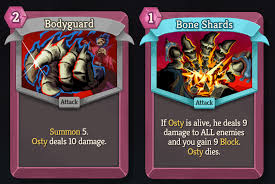 | 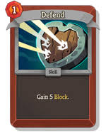   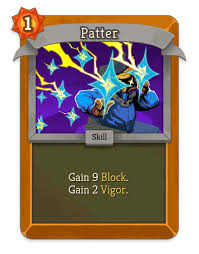 |

이는 카드 프레임 전체를 강하게 채색하는 방식보다는, 카드 내부의 조명, 효과, 주요 색 포인트 등을 통해 자연스럽게 구분되는 방향을 우선으로 생각하고 있습니다.

실제로 이후 카드 일러스트를 요청 드리게 된다면 이전에 사용하던 러프와 요청사항을 함께 전송드릴 예정입니다. 요청사항에는 기본적인 구도에서 일러스트의 주요 색 등이 포함될 수 있습니다. 실제 플레이 과정에서 카드 역할이 직관적으로 구분될 수 있는 가독성을 목표로 하고 있습니다.

## 배경 및 아이콘

배경은 카드가 놓일 필드, 시작 화면, 전투 준비화면 셋이 필요합니다.

필드는 다음 일러스트를 참고해주세요. 다만 실제 게임에서는 플레이 화면의 가독성과 제작 기간을 고려하여, 디테일과 묘사량은 이보다 많이 단순화된 방향을 예상하고 있습니다.

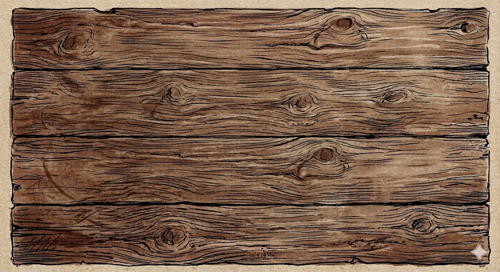

’ 현재 UI 중 일부인 전투 화면은 위 그림처럼 구성될 예정입니다.

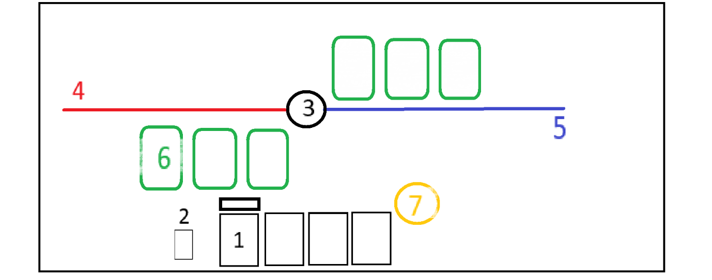

UI 역시 전체 배경 및 카드와 동일하게 거친 브러쉬 질감과 어두운 색조를 공유하는 방향을 생각하고 있습니다. 지나치게 화려한 판타지 UI보다는 제한된 장식을 가진 인터페이스를 목표로 하고 있습니다.

UI의 배치 및 세부 사항이 계속해서 변화할 수 있으므로, 주요 UI 요소들은 수정 가능한 형태로 레이어를 분리해주시면 감사하겠습니다. 다만 복잡한 애니메이션용 파츠 분리까지는 고려하지 않고 있습니다.

시작화면, 기타 UI들은 죄송하지만 아직 기획이 확정되지 않아서 레퍼런스로 제공할 그림이 없습니다. 전투 UI와 비슷한 수준으로, 과도한 디테일보다는 분위기와 가독성을 우선하리라 생각합니다.

아이콘은 그 외의, 덱 그림이나 상태이상 표시 등 잡다한 표기들을 통칭합니다. 아래 그림과 비슷한 정도의 아이콘들을 약 20개 정도 요청 드리게 될 듯합니다.

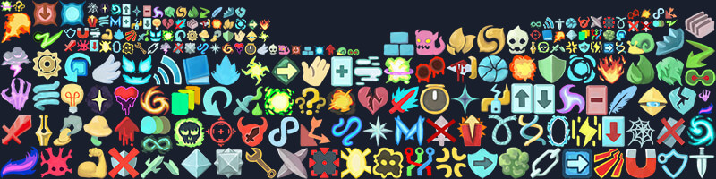

이 이외에도, 체력 바, 턴 표기, 버튼 등 조금 더 자세한 아이콘들도 존재합니다. 이러한 아이콘들은 레퍼런스처럼 단순 도형 중심으로, 아이콘을 통해 의미가 확실히 전달될 수 있도록 하고자 합니다. 아이콘은 단순성과 명확성을 위해 단색으로 구성될 예정입니다.

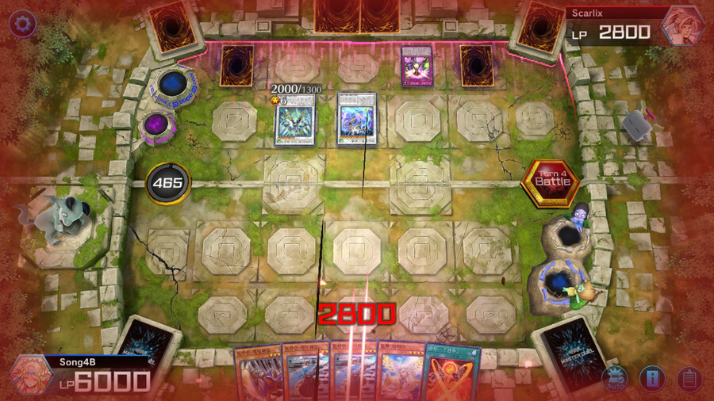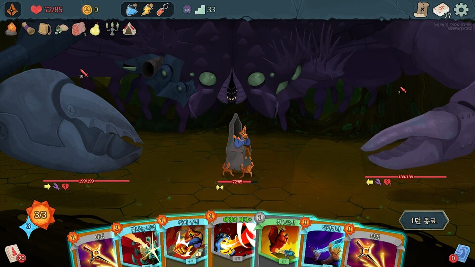 이런 종류의 아이콘들도 약 10개 정도 요청드릴 것 같습니다.
