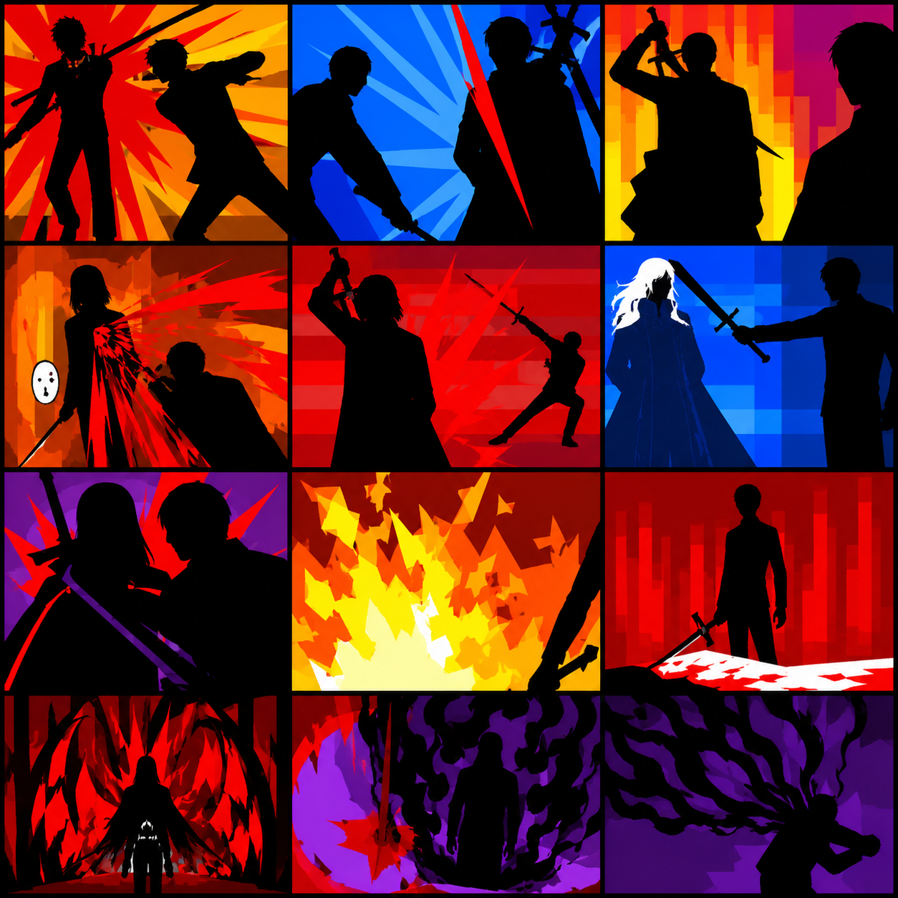
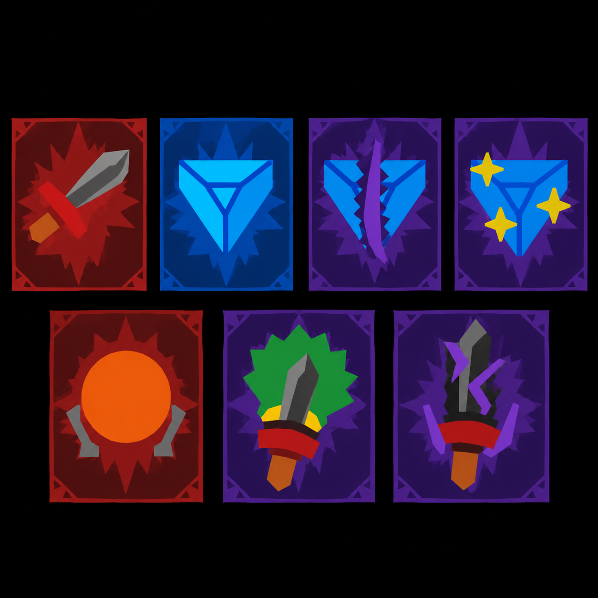
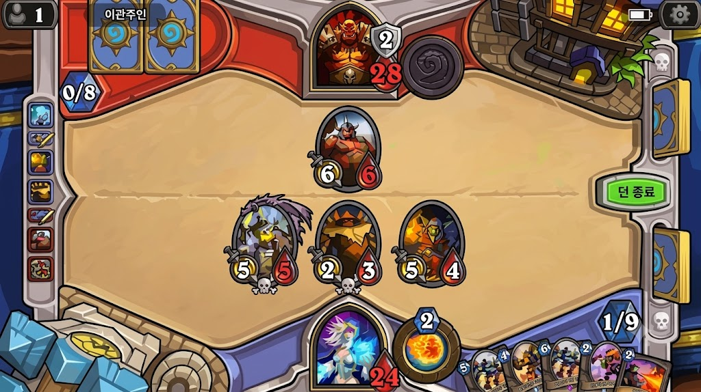
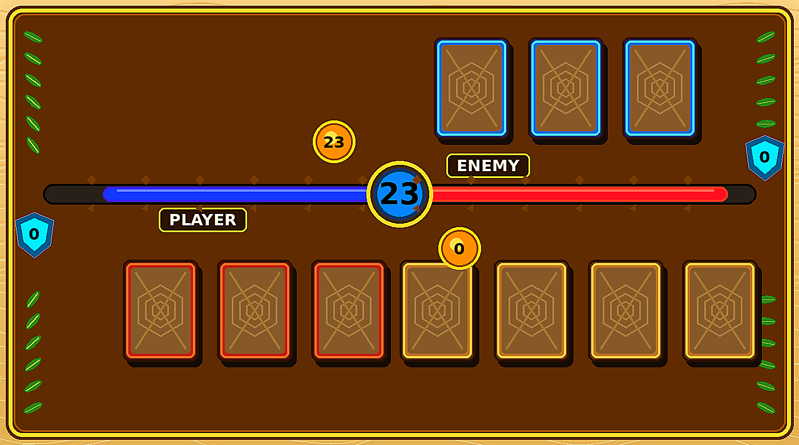

# 아트 스타일 수정사항

이번 문서는 기존에 전달드린 아트 기획서와 1차 아트 커미션에서 설명한 그림체 방향을 수정·보충하기 위한 내용입니다. 기존에 요청드렸던 그림들의 디자인과 이번 방향이 약간 상충할 수 있다는 점은 인지하고 있습니다. 다만 기존 결과물을 전부 다시 제작해 달라는 의미는 아니며, 앞으로 제작할 카드 일러스트와 UI 요소의 방향을 조금 더 명확하게 전달드리기 위한 문서입니다.

# 방향을 변경한 이유

처음 요청드릴 당시에는 배경 UI가 지금보다 시각적으로 강하게 보일 것이라 생각했습니다. 하지만 실제 화면에 적용해보니 배경 UI가 생각했던 것보다 시각적으로 연했고, 화면 전체의 요소가 비슷한 강도로 보여 역으로 플레이어의 주의를 앗아가는 것 같았습니다.

따라서 앞으로는 주요 카드와 UI 요소가 먼저 보이도록 채도와 색 대비를 높이고, 색의 경계와 외곽선을 더 명확하게 하고자 합니다. 배경 자체를 복잡하게 만드는 것보다는, 플레이어가 확인해야 하는 카드, 수치, 버튼 등이 배경보다 확실하게 앞에 보이는 방향을 우선하고자 합니다.

# 카드 일러스트

카드 일러스트는 아래 1번과 2번 레퍼런스에 가까운 스타일을 우선적으로 생각하고 있습니다.

|  **1번 레퍼런스** |  **2번 레퍼런스** |
| --- | --- |

구체적으로는 직선 기반의 기하학적 형태, 고채도 단색 블록, 최소한의 명암, 강한 실루엣과 극단적인 색 대비를 활용하는 플랫 벡터 포스터 스타일을 원합니다. 인물이나 사물을 사실적으로 묘사하기보다는, 적은 수의 큰 색면과 날카로운 형태를 사용하여 카드가 작게 표시되더라도 행동과 효과가 한눈에 읽히는 방향을 우선하고자 합니다.

한 형태 안에서는 가능한 한 색을 적게 사용하고, 재질이나 세부 질감 표현도 최소화해주시면 좋겠습니다. 특히 공격 방향, 무기, 효과가 발생하는 위치처럼 카드의 기능을 설명하는 부분은 실루엣과 색 대비만으로도 구분될 수 있으면 좋겠습니다.

**대체 가능한 카드 스타일**

다만 위와 같은 직선적이고 대비가 강한 그림체에 작업상 어려움이나 거부감이 있다면, 아래 3번 레퍼런스처럼 단색 위주의 툰체도 괜찮습니다.

**3번 레퍼런스 - 카드 일러스트 대체 방향**

이 경우에는 색을 부드럽게 연결하고, 1번과 2번보다 상대적으로 덜 극단적인 색 대비를 사용하며, 곡선을 더 적극적으로 활용해도 괜찮습니다. 대신 세부 묘사를 늘리기보다는 큰 색면과 단순한 형태로 내용을 전달한다는 기준은 유지하고자 합니다.

정리하면 카드 일러스트에서 가장 중요한 부분은 특정한 벡터 느낌을 그대로 따라가는 것이 아니라, 제한된 색과 단순한 형태로 카드의 행동과 기능이 강하게 전달되는 것입니다.

# 카드 이외의 게임 화면 및 UI

카드 이외의 게임 화면과 UI는 아래 4번 레퍼런스처럼 고채도 원색, 굵고 뚜렷한 외곽선, 단순한 플랫 셰이딩을 사용하는 툰 스타일을 원합니다.

**4번 레퍼런스 - 카드 이외의 게임 화면 및 UI 방향**

버튼, 수치, 카드 슬롯 등 게임에서 중요한 정보는 배경과 확실하게 구분되고, 색의 경계가 명확하게 보였으면 합니다. 재질 묘사나 복잡한 장식보다는 큰 형태와 외곽선으로 구조를 보여주는 방향을 우선하고자 합니다.

# 베타 단계에서의 단순화

다만 현재는 완성 단계가 아니라 베타에 가까운 단계이므로, 처음부터 4번 레퍼런스 정도의 장식과 디테일을 구현할 필요는 없습니다. 실제 제작은 아래 5번 레퍼런스처럼 해당 그림체 안에서 최대한 단순한 형태로 진행하고 싶습니다.

**5번 레퍼런스 - 베타 단계의 단순화 수준**

예를 들어 카드 슬롯, 게이지, 버튼, 테두리 등은 세부 장식을 많이 넣기보다 기본 형태와 색 구분을 먼저 잡아주시면 됩니다. 이후 실제 플레이 화면에서 필요성이 확인되는 부분부터 디테일을 추가하는 방식으로 생각하고 있습니다.

# 기존 UI 요소 및 적용 범위

이번 방향 변경이 현재 제작된 UI를 전면 수정한다는 의미는 아닙니다. 현재 제공된 "카드 구멍"을 비롯한 UI요소들은 그대로 진행할 계획입니다.

기존 UI의 기본 구조와 사용 방식은 유지하고, 앞으로 새로 제작되는 카드 일러스트 및 추가 UI 요소부터 이번에 정리한 채도, 대비, 외곽선 방향을 반영해주시면 될 것 같습니다. 기존 요소 중에서도 실제 적용 후 가독성 문제가 명확하게 확인되는 부분이 있다면, 그때 별도로 수정 요청을 드리겠습니다.

# 정리

작업에서 가장 중요하게 생각하는 순서는 카드의 행동과 효과가 즉시 읽히는 것, 주요 UI가 배경보다 먼저 보이는 것, 그리고 마지막으로 세부 장식과 질감을 추가하는 것입니다. 현재 단계에서는 완성도 높은 세부 묘사보다, 단순한 형태와 강한 색 대비를 통해 실제 플레이에서 정보가 확실히 전달되는 것을 우선하고자 합니다.
